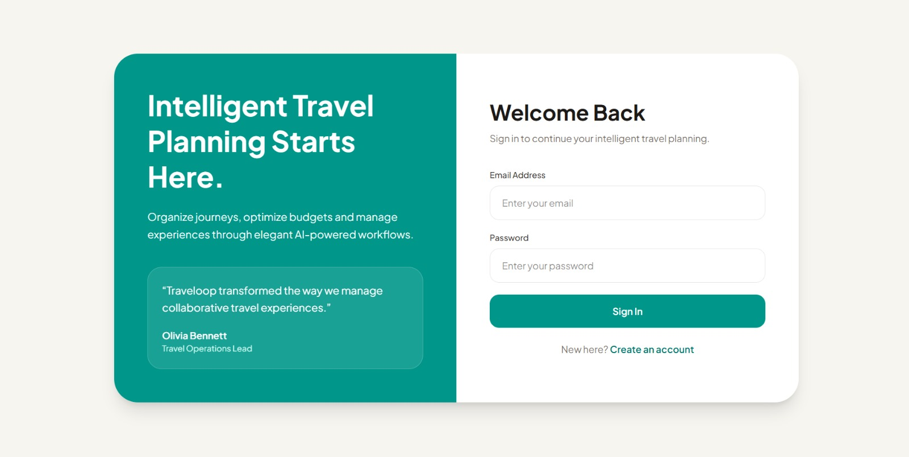
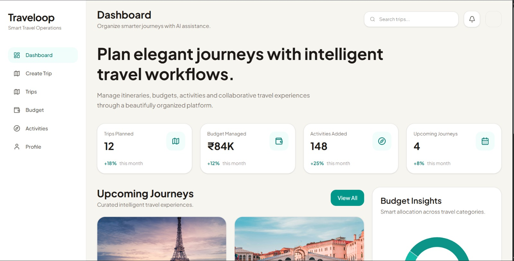
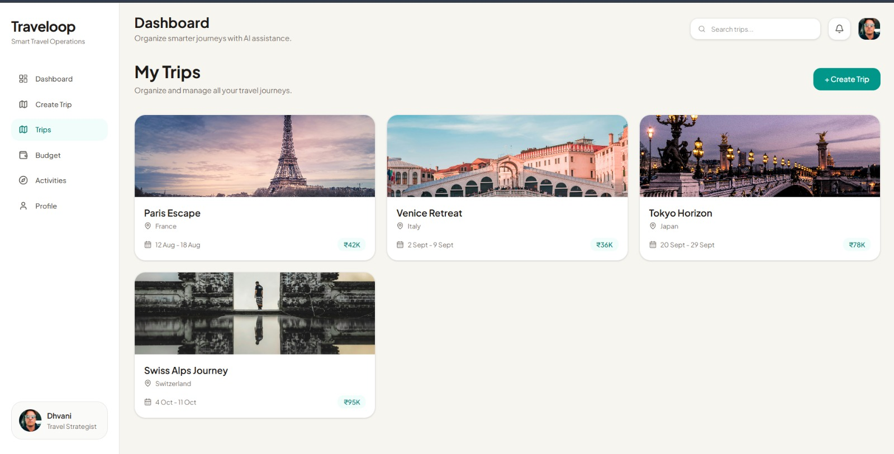
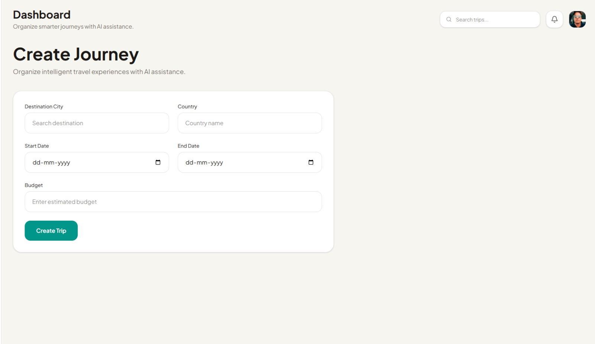
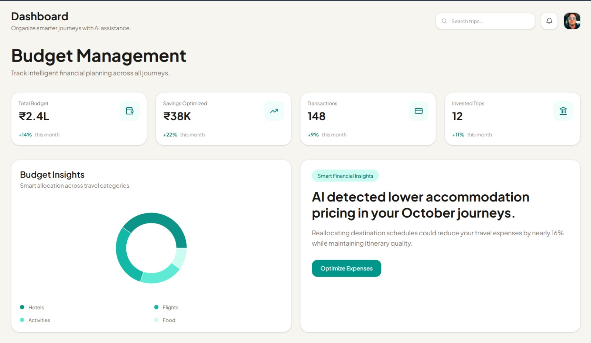
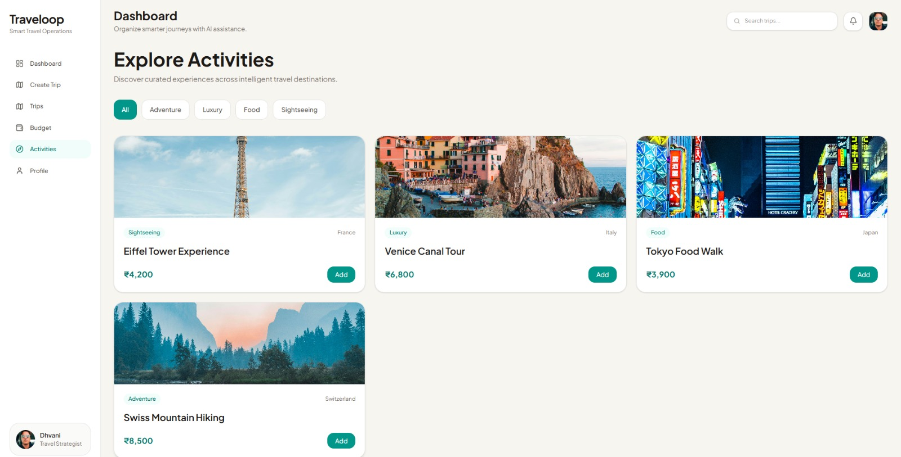

# 🗺️ Traveloop — Backend & Database

> Node.js + Express + PostgreSQL  
> Odoo Hackathon 2026

---

## 📁 Project Structure

```
traveloop-backend/
├── src/
│   ├── server.js                  ← Express app entry point
│   ├── config/
│   │   └── db.js                  ← PostgreSQL pool connection
│   ├── middleware/
│   │   └── auth.js                ← JWT authenticate + requireAdmin
│   ├── controllers/
│   │   ├── auth.controller.js     ← Register, Login, Profile
│   │   ├── trips.controller.js    ← Trip CRUD, share, clone
│   │   ├── stops.controller.js    ← Trip stops + activities
│   │   ├── cities.controller.js   ← City search + activity search
│   │   ├── budget.controller.js   ← Cost aggregation queries
│   │   ├── extras.controller.js   ← Packing list + Trip notes
│   │   ├── public.controller.js   ← Public shared trip view
│   │   └── admin.controller.js    ← Analytics dashboard
│   └── routes/
│       ├── auth.routes.js
│       ├── trips.routes.js
│       └── other.routes.js        ← cities, public, admin
├── migrations/
│   └── run.js                     ← Creates all tables + triggers
├── seeds/
│   └── run.js                     ← Populates cities + activities
├── .env.example
└── package.json
```

---

## ⚙️ Setup (do this first!)

### 1. Install dependencies
```bash
npm install
```

### 2. Create your .env
```bash
cp .env.example .env
# Fill in DB_PASSWORD and JWT_SECRET
```

### 3. Create PostgreSQL database
```bash
psql -U postgres -c "CREATE DATABASE traveloop;"
```

### 4. Run migrations (creates all tables)
```bash
node migrations/run.js
```

### 5. Seed data (cities + activities)
```bash
node seeds/run.js
```

### 6. Start the server
```bash
npm run dev        # development (nodemon)
npm start          # production
```

Server runs on: **http://localhost:5000**

---

## 🗄️ Database Schema

```
┌──────────┐     ┌──────────────┐     ┌──────────────┐     ┌─────────────────┐
│  users   │────<│    trips     │────<│  trip_stops  │────<│ stop_activities │
└──────────┘     └──────────────┘     └──────────────┘     └─────────────────┘
                                             │                      │
                                             ▼                      ▼
                                        ┌────────┐           ┌────────────┐
                                        │ cities │           │ activities │
                                        └────────┘           └────────────┘

trips ──< packing_items
trips ──< trip_notes ──> trip_stops (optional)
```

### Tables

| Table | Purpose | Key Columns |
|---|---|---|
| `users` | Auth & profile | id (UUID), email (UNIQUE), password_hash, is_admin |
| `trips` | Trip plans | id (UUID), user_id→users, start_date, end_date, budget_limit, share_token |
| `cities` | Seed city catalog | id, name, country, cost_index, currency_code |
| `activities` | Seed activity catalog | id, city_id→cities, name, category, cost |
| `trip_stops` | Cities in a trip | id, trip_id→trips, city_id→cities, order_index, accommodation_cost |
| `stop_activities` | Activities in a stop | id, stop_id→trip_stops, activity_id→activities, custom_cost |
| `packing_items` | Checklist per trip | id, trip_id→trips, name, category, is_packed |
| `trip_notes` | Notes per trip/stop | id, trip_id→trips, stop_id (nullable), content |

### Key Relationships
- `trips` → `trip_stops` → `cities` (many-to-many via junction)
- `trip_stops` → `stop_activities` → `activities` (many-to-many via junction)
- Users can add **custom activities** (no activity_id, just custom_name + custom_cost)
- Public sharing via `share_token` (short random string), no auth needed to read

---
## 📡 Full API Reference

All protected routes need: `Authorization: Bearer <token>`

### Auth — `/api/auth`

| Method | Path | Auth | Description |
|--------|------|------|-------------|
| POST | `/register` | ❌ | Create account |
| POST | `/login` | ❌ | Login, returns JWT |
| GET | `/me` | ✅ | Get current user |
| PUT | `/profile` | ✅ | Update name/avatar/language |
| DELETE | `/account` | ✅ | Delete account |

**Register body:** `{ name, email, password }`  
**Login body:** `{ email, password }`  
**Response:** `{ token, user }`

---

### Trips — `/api/trips`

| Method | Path | Description |
|--------|------|-------------|
| GET | `/` | List my trips (with stop count + total cost) |
| POST | `/` | Create trip |
| GET | `/:id` | Get full trip with stops + activities |
| PUT | `/:id` | Update trip metadata |
| DELETE | `/:id` | Delete trip |
| POST | `/:id/share` | Toggle public sharing, returns share_url |
| POST | `/:id/clone` | Clone trip into my account |
| GET | `/:id/budget` | Full cost breakdown |


**Create/Update body:**
```json
{
  "title": "Europe Summer 2026",
  "description": "3 weeks in Europe",
  "start_date": "2026-07-01",
  "end_date": "2026-07-21",
  "budget_limit": 3000,
  "cover_image": "https://..."
}
```

---

### Stops — `/api/trips/:tripId/stops`

| Method | Path | Description |
|--------|------|-------------|
| POST | `/stops` | Add a city stop |
| PUT | `/stops/reorder` | Reorder stops |
| PUT | `/stops/:stopId` | Update stop dates/costs |
| DELETE | `/stops/:stopId` | Remove stop |
| POST | `/stops/:stopId/activities` | Add activity to stop |
| DELETE | `/stops/:stopId/activities/:actId` | Remove activity |

**Add stop body:**
```json
{
  "city_id": 1,
  "arrival_date": "2026-07-01",
  "departure_date": "2026-07-05",
  "accommodation_cost": 400,
  "transport_cost": 80
}
```

**Add activity body:**
```json
{
  "activity_id": 3,
  "scheduled_date": "2026-07-02",
  "scheduled_time": "10:00"
}
// OR custom activity:
{
  "custom_name": "Private Boat Tour",
  "custom_cost": 150,
  "custom_duration_hrs": 3,
  "scheduled_date": "2026-07-03"
}
```

**Reorder body:**
```json
{ "order": [{ "id": 5, "order_index": 0 }, { "id": 3, "order_index": 1 }] }
```

---

### Cities — `/api/cities`

| Method | Path | Description |
|--------|------|-------------|
| GET | `/?search=paris&region=Europe` | Search cities |
| GET | `/:id` | City details + all activities |
| GET | `/:id/activities?category=food&maxCost=50` | Filter activities |

---

### Budget — `/api/trips/:id/budget`

Returns a rich breakdown for the Budget screen:
```json
{
  "trip_id": "...",
  "budget_limit": 3000,
  "grand_total": 2450.50,
  "budget_remaining": 549.50,
  "duration_days": 21,
  "avg_cost_per_day": 116.69,
  "category_breakdown": {
    "transport": 280,
    "accommodation": 1200,
    "activities": 970.50
  },
  "stops": [...per-stop breakdown...],
  "days": [
    { "day": "2026-07-01", "activities_cost": 95, "status": "ok" },
    { "day": "2026-07-02", "activities_cost": 210, "status": "over" }
  ]
}
```

---

### Packing List — `/api/trips/:tripId/packing`

| Method | Path | Description |
|--------|------|-------------|
| GET | `/packing` | Get all items |
| POST | `/packing` | Add item `{ name, category }` |
| PATCH | `/packing/:itemId` | Toggle is_packed |
| DELETE | `/packing/:itemId` | Delete item |
| DELETE | `/packing` | Reset all (mark unpacked) |

Categories: `clothing | documents | electronics | other`

---

### Notes — `/api/trips/:tripId/notes`

| Method | Path | Description |
|--------|------|-------------|
| GET | `/notes?stopId=5` | Get notes (optionally per stop) |
| POST | `/notes` | Add note `{ content, stop_id? }` |
| PUT | `/notes/:noteId` | Update note |
| DELETE | `/notes/:noteId` | Delete note |

---

### Public Trips — `/api/public` (no auth)

| Method | Path | Description |
|--------|------|-------------|
| GET | `/trip/:token` | View shared itinerary (read-only) |

---

### Admin — `/api/admin` (is_admin = true required)

| Method | Path | Description |
|--------|------|-------------|
| GET | `/analytics` | Full dashboard stats |
| GET | `/users` | All users + trip counts |
| DELETE | `/users/:id` | Remove a user |

**Analytics response includes:** total users, trips created per day (30d), top cities bar chart data, user growth line chart data.

---

### Auth flow
1. POST `/api/auth/register` or `/login` → get `token`
2. Store token in localStorage
3. Every request: `Authorization: Bearer <token>` header

### Full user journey API calls
```
Register → Login
→ GET /api/trips                    (My Trips screen)
→ POST /api/trips                   (Create Trip)
→ GET /api/cities?search=           (City Search)
→ POST /api/trips/:id/stops         (Add Stop)
→ GET /api/cities/:id/activities    (Activity Search)
→ POST /api/trips/:id/stops/:stopId/activities  (Add Activity)
→ GET /api/trips/:id/budget         (Budget Screen)
→ GET /api/trips/:id                (Itinerary View)
→ POST /api/trips/:id/share         (Get Share URL)
→ GET /api/public/trip/:token       (Public View - no auth)
```

### CORS
Backend allows requests from `http://localhost:5173` (Vite default).  
Change `FRONTEND_URL` in `.env` if different.

---

---

# 🎨 Frontend Overview

Traveloop frontend is built using a modern SaaS-inspired UI architecture focused on intelligent travel planning, budgeting, analytics, and seamless user experience.

Built with React, Tailwind CSS, and Vite for fast performance and scalable component management. :contentReference[oaicite:0]{index=0}

---

# 🚀 Frontend Features

## 🔐 Authentication
- User Login
- User Registration
- Protected Dashboard Flow
- Logout Functionality
- Token-ready Authentication Architecture

---

## 📊 Dashboard
- Smart Analytics Dashboard
- KPI Statistics Cards
- AI Recommendation Panels
- Budget Insights
- Recent Activity Timeline
- Upcoming Journeys Section

---

## ✈️ Trips Management
- Create New Trip
- View All Trips
- Dynamic Trip Cards
- Destination & Budget Overview
- Backend-ready Trip Fetching Structure

---

## 💰 Budget Management
- Budget Analytics
- Expense Insights
- AI Budget Optimization Suggestions
- Interactive Charts using Recharts

---

## 🌍 Activities Explorer
- Explore Travel Activities
- Category Filtering UI
- Experience Cards
- Travel Recommendations

---

## 👤 Profile Management
- Edit User Details
- Logout Support
- Account Settings UI

---

# 🛠 Frontend Tech Stack

| Technology | Purpose |
|---|---|
| React | Frontend Framework |
| Vite | Build Tool |
| Tailwind CSS | Styling |
| React Router DOM | Routing |
| Axios | API Requests |
| Recharts | Analytics Graphs |
| Lucide React | Icons |

---

# 📁 Frontend Folder Structure

```bash
src/
│
├── components/
│   ├── cards/
│   ├── layout/
│   └── ui/
│
├── pages/
│   ├── auth/
│   ├── dashboard/
│   ├── trips/
│   ├── budget/
│   ├── activities/
│   └── profile/
│
├── routes/
├── services/
├── styles/
└── App.jsx
```
---

# 📸 Application Screenshots

## 🔐 Authentication Page



---

## 📊 Smart Dashboard



---

## ✈️ Trips Management



---

## 📝 Create Journey



---

## 💰 Budget Management



---

## 🌍 Activities Explorer


